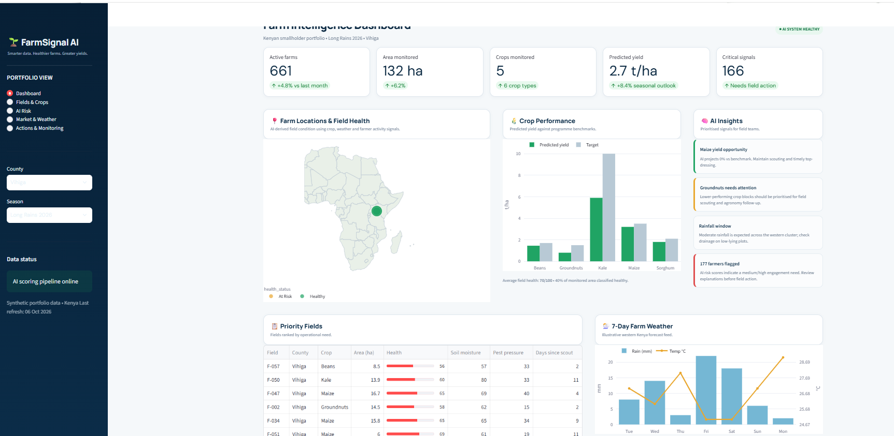

## Quick Start (Windows)

The repository includes an automated Windows launcher that creates a virtual environment, installs the pinned dependencies, prepares the data/model artifacts when needed, and starts Streamlit.

### Option 1 — one-click launch

Double-click `run_dashboard.bat`.

### Option 2 — PowerShell

```powershell
Set-ExecutionPolicy -Scope Process -ExecutionPolicy Bypass
.\setup_and_run.ps1
```

### Option 3 — manual

```powershell
python -m venv .venv
.\.venv\Scripts\Activate.ps1
python -m pip install --upgrade pip setuptools wheel
pip install -r requirements.txt
python src\generate_data.py
python src\train_model.py
python src\orchestrator.py
python -m streamlit run src\dashboard.py
```

> **Python compatibility:** FarmSignal AI v3 uses a pinned dependency stack designed for modern Windows Python environments, including Python 3.14. Pinning `Jinja2` and `Altair` prevents pip from backtracking into obsolete Jinja2 releases during Streamlit installation.

# FarmSignal AI — Kenya Farm Intelligence Dashboard

> **AI-powered farm risk intelligence, explainable predictions, and field-action prioritisation for Kenyan smallholder agriculture.**

FarmSignal AI is an end-to-end **machine learning + data engineering + decision-support** portfolio project. It converts synthetic farmer and farm-management signals into explainable risk scores, operational actions, and a management dashboard designed around Kenyan agricultural programmes.

**Important:** All farmer, farm, weather, soil, market and outcome records in this repository are synthetic. The model metrics are controlled benchmark results on that synthetic dataset and **must not be interpreted as real-world predictive performance**.

### Actual Streamlit Dashboard

The image below is a screenshot of the live Streamlit dashboard interface (not a generated mock-up).



---

## Why this project exists

Agricultural programmes often have plenty of data but limited ability to turn that data into timely action. FarmSignal AI demonstrates a practical pipeline for moving from:

**Data → ML prediction → Explainability → Prioritisation → Field action → Monitoring**

The project is designed to answer questions such as:

- Which farmers or fields require attention first?
- What signals are driving their risk?
- Should the programme send an SMS, create a field visit, or escalate the case?
- Which counties and crops are performing below expectations?
- What are soil, rainfall and pest signals suggesting?
- How can managers monitor whether automated actions are being generated and delivered?

---

## Key capabilities

### 1. AI risk prediction

An **XGBoost classifier** predicts synthetic farmer default/dropout risk using observable programme signals including:

- Days since last farm visit
- Input redemption rate
- Agronomic training attendance
- Group repayment performance
- Previous-season yield index
- Distance to agrodealer
- Mobile-money activity
- Loan amount
- Programme tenure
- Farm size and demographics

### 2. Explainable AI

SHAP is used to translate model output into field-friendly explanations such as:

> Low input redemption rate; long gap since last farm visit

This makes the prediction more actionable than presenting a probability alone.

### 3. Automated action orchestration

Risk tiers are connected to mocked operational channels:

| Risk | Automated response |
|---|---|
| High | Supervisor escalation |
| Medium | Field-agent follow-up task |
| Low | Farmer SMS nudge |

The channel clients are deliberately separated from the rules engine so they can later be replaced with real APIs.

### 4. Kenyan agricultural intelligence

The dashboard uses Kenyan programme conventions including:

- **Counties:** Kakamega, Bungoma, Busia, Vihiga, Trans Nzoia and Siaya
- **Crops:** maize, beans, sorghum, tomatoes, kale and groundnuts
- **Land:** hectares / acres
- **Yield:** tonnes per hectare
- **Market prices:** KES/kg
- **Weather:** rainfall and forecast signals
- **Field health:** healthy / at risk / critical
- **Operational units:** farmers, field agents, supervisors and programme managers

### 5. Management dashboard

The Streamlit dashboard combines:

- Executive KPIs
- Field-health intelligence
- Crop performance
- AI insights
- Soil-moisture trends
- Weather outlook
- Market intelligence
- Risk distribution
- Priority farmer/field lists
- Recent alerts
- Action monitoring

---

## Model performance

The current synthetic benchmark was generated with a controlled latent risk process and **1% label noise** to create a challenging but learnable classification problem.

The model is evaluated on a fixed **25% held-out test set**.

| Metric | Held-out test result |
|---|---:|
| **ROC-AUC** | **0.976** |
| Accuracy | 92.8% |
| Precision | 90.3% |
| Recall | 80.4% |
| F1-score | 85.1% |
| Precision among top 15% highest-risk | **98.7%** |
| Test observations | 1,000 |

The exact metrics are also stored in [`models/model_metrics.json`](models/model_metrics.json).

### Why the 0.976 AUC should be interpreted carefully

This is a **portfolio demonstration dataset**, not a real agricultural impact study. The synthetic outcome is intentionally generated from observable risk signals so that the repository can demonstrate a credible end-to-end ML workflow and model monitoring story.

A production deployment would require:

- real longitudinal farmer outcomes;
- temporal validation rather than random splitting;
- leakage assessment;
- calibration analysis;
- subgroup/fairness checks;
- external validation;
- threshold optimisation based on programme capacity and cost;
- monitoring for data and concept drift.

The objective is therefore to demonstrate **engineering and analytical capability**, not to claim that the model will achieve 0.976 AUC on real farmers.

---

## Architecture

```text
                    FARMER / FARM DATA
                           │
                           ▼
                  Data preparation layer
                           │
                           ▼
                 Feature engineering
                           │
                           ▼
                ┌────────────────────┐
                │   XGBoost Model    │
                │ Risk classification│
                └────────────────────┘
                           │
                 ┌─────────┴─────────┐
                 ▼                   ▼
          Risk probability       SHAP values
                 │                   │
                 └─────────┬─────────┘
                           ▼
                  Explainable risk
                           │
                           ▼
                  Decision / rules
                           │
            ┌──────────────┼──────────────┐
            ▼              ▼              ▼
          SMS         Field task      Escalation
            │              │              │
            └──────────────┼──────────────┘
                           ▼
                 Operational action log
                           │
                           ▼
                  FarmSignal dashboard
                           │
        ┌──────────────────┼──────────────────┐
        ▼                  ▼                  ▼
      Fields             Crops        Weather / Market
```

---

## Repository structure

```text
farmsignal-ai/
│
├── data/
│   ├── farmers.csv
│   └── risk_scores.csv
│
├── docs/
│   └── dashboard_screenshot.png
│
├── logs/
│   └── actions_log.csv
│
├── models/
│   ├── global_feature_importance.csv
│   ├── model_metrics.json
│   └── risk_model.json
│
├── src/
│   ├── dashboard.py
│   ├── generate_data.py
│   ├── orchestrator.py
│   └── train_model.py
│
├── .gitignore
├── LICENSE
├── README.md
├── requirements.txt
└── run_dashboard.bat
```

---

## Technology stack

**Data & analytics**

- Python
- Pandas
- NumPy
- Scikit-learn

**Machine learning**

- XGBoost
- SHAP

**Dashboard**

- Streamlit
- Plotly

**Engineering concepts**

- Reproducible synthetic data generation
- Train/test evaluation
- Explainable AI
- Rules-based decisioning
- Action orchestration
- Audit logging
- Modular integration interfaces

---

## Run the project locally

### 1. Clone the repository

```bash
git clone https://github.com/<your-username>/farmsignal-ai.git
cd farmsignal-ai
```

### 2. Create a virtual environment

Windows:

```bash
python -m venv .venv
.venv\Scripts\activate
```

macOS/Linux:

```bash
python3 -m venv .venv
source .venv/bin/activate
```

### 3. Install dependencies

```bash
pip install -r requirements.txt
```

### 4. Rebuild the data and model

```bash
python src/generate_data.py
python src/train_model.py
python src/orchestrator.py
```

### 5. Launch the dashboard

```bash
python -m streamlit run src/dashboard.py
```

Or on Windows, double-click:

```text
run_dashboard.bat
```

---

## Reproducibility

The synthetic data generator and model use fixed random seeds so that the benchmark can be regenerated consistently.

The training pipeline writes:

```text
models/risk_model.json
models/model_metrics.json
models/global_feature_importance.csv
data/risk_scores.csv
```

The action pipeline writes:

```text
logs/actions_log.csv
```

---

## Example decision workflow

A farmer with a high predicted risk might have an explanation such as:

```text
High risk
↓
Low input redemption
+ long gap since farm visit
↓
Supervisor escalation
↓
Case recorded in action log
```

A medium-risk farmer might instead generate:

```text
Medium risk
↓
Field-agent follow-up task
↓
Farm visit / verification
↓
Corrective action
```

This illustrates the project's central idea: **a prediction should lead to a decision, not just another dashboard number.**

---

## Production roadmap

A production-grade implementation could integrate:

- Kenya Meteorological Department or approved weather APIs
- market-price feeds;
- farm and field GIS data;
- mobile data collection through KoboToolbox / ODK;
- DHIS2-style programme reporting where applicable;
- SMS through Africa's Talking or another approved provider;
- CRM / farmer-management platforms;
- PostgreSQL or a managed analytical warehouse;
- scheduled model scoring;
- MLflow/model registry;
- model and data drift monitoring;
- role-based access control;
- audit trails;
- automated retraining and model approval workflows.

---

## Responsible AI considerations

A real deployment should not automatically deny farmers credit, inputs, services or benefits solely because a model assigns a high risk score.

Recommended controls include:

- human review for high-impact decisions;
- transparent explanations;
- minimum necessary data collection;
- protection of personally identifiable information;
- subgroup performance monitoring;
- bias and fairness assessment;
- model calibration;
- clear escalation and appeal processes;
- documented model/version governance.

---

## Portfolio value

FarmSignal AI demonstrates the ability to work across the full analytics lifecycle:

**Data engineering → statistical/ML modelling → explainable AI → automation → dashboarding → operational decision support.**

It is particularly relevant to roles in:

- Data Science
- Machine Learning Engineering
- Monitoring & Evaluation
- Agricultural Data Analytics
- Impact Measurement
- Digital Agriculture
- Programme Intelligence
- Business Intelligence

---

## License

Released under the [MIT License](LICENSE).

---

## Author

**Victor Otieno Opiyo**  
Biostatistics • Data Science • Monitoring & Evaluation • Health & Development Analytics

---

## Streamlit Community Cloud deployment

FarmSignal AI is packaged so the deployed dashboard does **not** install the optional ML training stack. The repository already contains the generated risk scores, feature-importance output and action log consumed by the dashboard.

### Streamlit Community Cloud settings

- **Repository:** your GitHub FarmSignal AI repository
- **Branch:** `main`
- **Main file:** `src/dashboard.py`
- **Python:** select **3.12** in the app's Advanced settings when deploying/redeploying
- **Dependency file:** root `requirements.txt`

The production `requirements.txt` intentionally contains only the dashboard runtime dependencies:

- Streamlit
- pandas
- NumPy
- Plotly

The optional `requirements-ml.txt` contains SHAP, XGBoost and scikit-learn for local model regeneration only. It should not be used as the Community Cloud dependency file.

### Important deployment note

Do **not** run `generate_data.py`, `train_model.py` or `orchestrator.py` as part of the Streamlit Cloud startup process. Their generated outputs are already committed to the repository and are loaded directly by `src/dashboard.py`.

### Local launch

For the dashboard only:

```powershell
python -m venv .venv
.venv\\Scripts\\Activate.ps1
python -m pip install -r requirements.txt
python -m streamlit run src/dashboard.py
```

For ML/model regeneration, install `requirements-ml.txt` separately and run the training pipeline locally.
